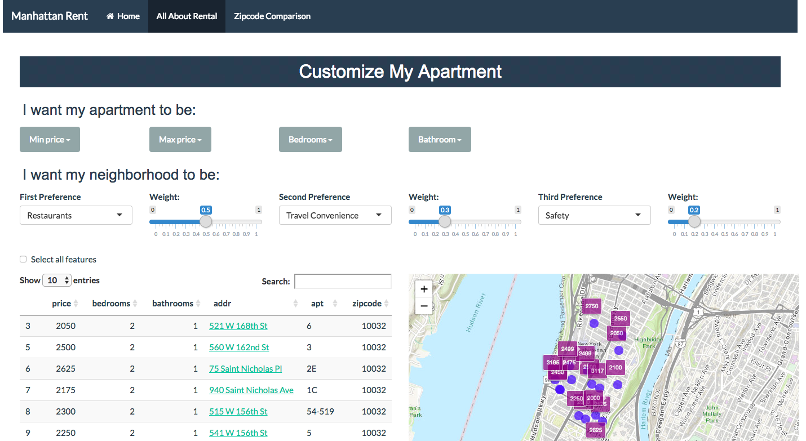

# Project 2: Rent by Your Priority Preferences



## Rent by Your Priority Preferences
Term: Fall 2018

+ Group 6 
+ **Rent by Your Priority Preferences**: 
	+ **Team members**: 
	+ Bai, Ruoxi  rb3313@columbia.edu
	+ Cui, Jiayi  jc4884@columbia.edu
	+ Li, Zhirong  zl2628@columbia.edu
	+ Pei, Yukun  yp2446@columbia.edu
	+ Smith, Kayla kys2112@columbia.edu

+ **Project summary**: 

Rental Apps generally care about the preference of the majority, while our App focuses on your priority preference.

This app provides a platform for people to search house rental based on their most cared issues. We include safety, transportation, nightlife, price, entertainment, food and shopping. Users can pick 3 top prior features and we give recommendation according to the ranked priorities.

On the 'All about Rental' Page, users can not only filter by house type and price range, but also choose 3 top preferences and their weights. The recommendation system will then show the top 20 most suitable houses. Also, the dot map shows where the house is and save the trouble of searching them on Google map. Moreover, when you click on the map, a hover will shows above it providing address, price, type, size, year built, appliance and an image of the house.

On the 'Zipcode Comparison' page, users can choose whichever zip code they want, and see how good this area is in different features comparing to other Manhattan regions. Our App also provides price trend plots which not only shows the historical price, but also the predicted price trend in the next 12 months. This page allows you to compare the housing among the whole Manhattan and the price over time at the same time.

+ How to use the App
	+ All about Rental
		+ You may choose 3 features that you are concerned about most, and even give weight to them. Set price range and house type. If you have a prefered zipcode, you may also add it to filter. Then you will see our recommendation for you.
  		+ Houses will be shown on the dot map beside. If you don't have a zipcode preference, just zoom in and zoom out on the dot map and you will see filtered choices in different regions.
		+ You may also zoom in to see the neighbourhood and a hover showing an image of the house and other detailed informations.
		+ If you already have a candidate apartment, the 'Do I Have a Good Deal' section will let you know if the price is fair.
	+ Zipcode Comparison
		+ You may select your concerned zipcodes (4 at most), features, cuisines, safety issues, and preferred travel, night life and recreation methods, and the Neighbourhood Features Tab shows you what position the zipcode area is in each features.
		+ The Time Series Tab shows you the historical trend of median prices of selected zipcode areas.
		+ Just for your reference, the Prediction Tab provides predicted median prices of selected zipcode areas in the next 12 months.

+ **Contribution statement**: 

	+ Data Processing: Jiayi Cui, Ruoxi Bai, Zhirong Li
	+ UI&Server Building: Ruoxi Bai, Zhirong Li(page 1), Kayla Smith(page 2)
	+ CSS Design: Ruoxi Bai, Zhirong Li, Yukun Pei
	+ Home Page Design: Yukun Pei
	+ Time Series Prediction: Jiayi Cui, Kayla Smith
	+ Feature Score Calculation: Ruoxi Bai


Following [suggestions](http://nicercode.github.io/blog/2013-04-05-projects/) by [RICH FITZJOHN](http://nicercode.github.io/about/#Team) (@richfitz). This folder is orgarnized as follows.

```
proj/
├── app/
├── lib/
├── data/
├── doc/
└── output/
```

Please see each subfolder for a README file.

